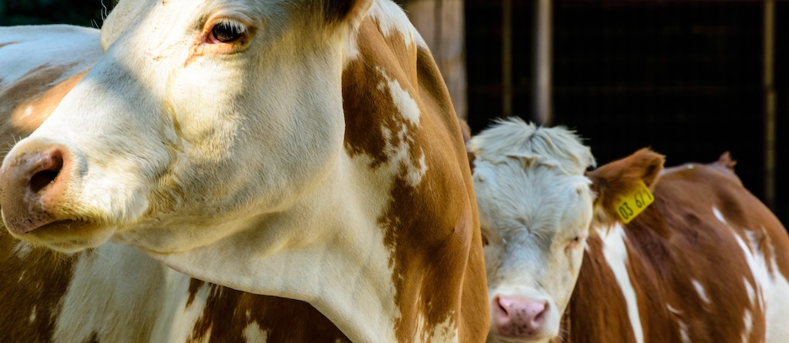

cattlectl - gain control over your ranch
========================================



[Rancher](https://rancher.com/) is a great platform to have a central configuration management over all your clusters and projects.<br>
It comes with an out of the box deployment mechanic for [helm charts](https://github.com/helm/helm). These charts are flavored with two extra files to have a pretty UI for creating and upgrading apps based on this charts.<br>
It also comes with a pretty API to remote control everything you can control in the Web-UI.

But it misses some mechanism as [Helmsman](https://github.com/Praqma/helmsman) wich allows you to have your full deployment written as code and deployed to what ever wanted target  cluster and project.

Getting startet
---------------

### Installing `cattlectl`

```bash
go get github.com/bitgrip/cattlectl
```

or build it from source. Since cattlectl is a go module you can clone the repository where ever you want.

```bash
git clone https://github.com/bitgrip/cattlectl.git
cd cattlectl
go install
```

### Create your project descriptor

* In your HOME directory create a file `.cattlectl.yaml` with the example content:

```yaml
---
rancher:
  url: https://<your rancher host>
  access_key: <your access-key>
  secret_key: <your secret-key>
  cluster_id: <your cluster-id>
```

* If you need to use self signed certificates you can also add the correct root ca to `.cattlectl.yaml`.
  * You can use the `--insecure-api` to skip certificate validation

```yaml
---
rancher:
  ...
  ca_certs: |
    <your ca certs>
```

* In your current directory store a file `project.yaml` with the example content:

```yaml
---
api_version: v1.0
kind: Project
metadata:
  name: my-wordpress
namespaces:
  - name: my-wordpress-web
apps:
- name: editorial-namespace
  catalog: library
  chart: wordpress
  version: "2.1.10"
  namespace: my-wordpress-web
  answers:
    wordpressEmail: user@example.com
    mariadb.enabled: true

```

### Apply your project descriptor to your rancher instance

```bash
cattlectl apply
```

Finding more informations
-------------------------

* [Descriptor templates](descriptor_templates.md)
* [RancherDescriptor data model](rancher_descriptor.md)
* [ClusterDescriptor data model](cluster_descriptor.md)
* [ProjectDescriptor data model](project_descriptor.md)
* [cattlectl CLI documentation](cattlectl.md)
